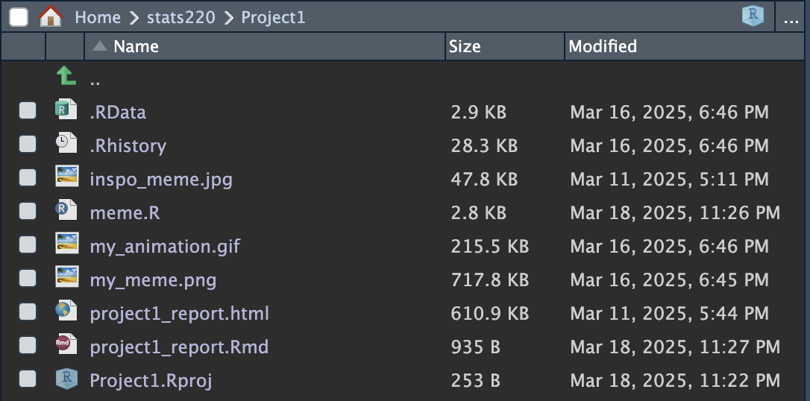
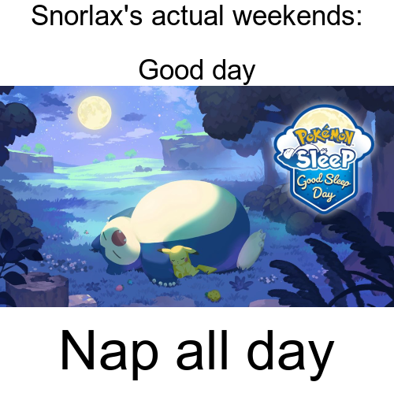

```{r setup, include=FALSE}
knitr::opts_chunk$set(echo=TRUE, message=FALSE, warning=FALSE, error=FALSE)
```

```{css}
p,h1,h2,h3,h4 {
  font-family: 'Lucida Sans', 'Lucida Sans Regular', 'Lucida Grande', 'Lucida Sans Unicode', Geneva, Verdana, sans-serif;
}
h1, h2, h3 {
  font-weight: bold;
}
h2, h3 {
  background-clip: text;
  background-image: linear-gradient(to right, lightblue, green);
  color: transparent;
}
html, body {
  background: linear-gradient(to right, aliceblue, lightblue);
}
img {
  border-radius: 0.4em;
  padding: 1em;
}
img:hover {
  background-color: #6ac5fe;
  border-radius: 0.4em;
  padding: 1em;
  transition: 500ms;
}
```

## Project requirements


Here is a [link to my stats220 GitHub page](https://github.com/jeffplays2005/stats220/tree/main)!

## Inspo meme

Inspirational meme:


The key components towards this meme is that there is a single image as the focus and a single line of text at the top annotating the meme. 

## My meme



I changed the following in my meme:

* The image
* The text formatting, there are two lines of text, one at the top, one at the bottom.
* The text is also different but bases off of a similar idea in the inspirational meme. 

## My animated meme


## Creativity

My project demonstrates creativity because of the following reasons:

* My animation is based off of 4 different frames.
  * Each of the frames have the same style as the other frames so there is a uniform style across the animation.
* My project changes the text and uses a header **and** a footer!
* My project uses a good sense of humor!!
* There is a creative usage of CSS in combination with this markdown to give a nice theme!
  * There is a gradient that has a similar theme to my inspirational image colours.
  * I change the font to a different one that looks a bit more "pokémon themed"
  * Images have a hover effect that applies a darker light-blue with a transition time. 
  * Font colour changed for h2 and h3!

## Learning reflection

A very important idea I learnt is a lot of the crucial methods/functions that the `magick` library uses! For example, I learnt how to read, scale, annotate, and combine images! This is a very important skill as I had a project involving some basic image processing and R language seems very fast at doing this.

I'm just more curious on learning how fast R language actually runs, estimates of how fast image processing/editing is. The project I had in mind would preferably have a fast image editor that optimally doesn't require a computationally expensive component to render quickly. I'm also quite curious as to if we have any more image processing, this was very fun and interesting to do!

## Appendix

<mark>Do not change, edit, or remove the `R` chunk included below.</mark>

If you are working within RStudio and within your Project1 RStudio project (check the top right-hand corner says "Project1"), then the code from the `meme.R` script will be displayed below.

This code needs to be visible for your project to be marked appropriately, as some of the criteria are based on this code being submitted.


```{r file='meme.R', eval=FALSE, echo=TRUE}

```
