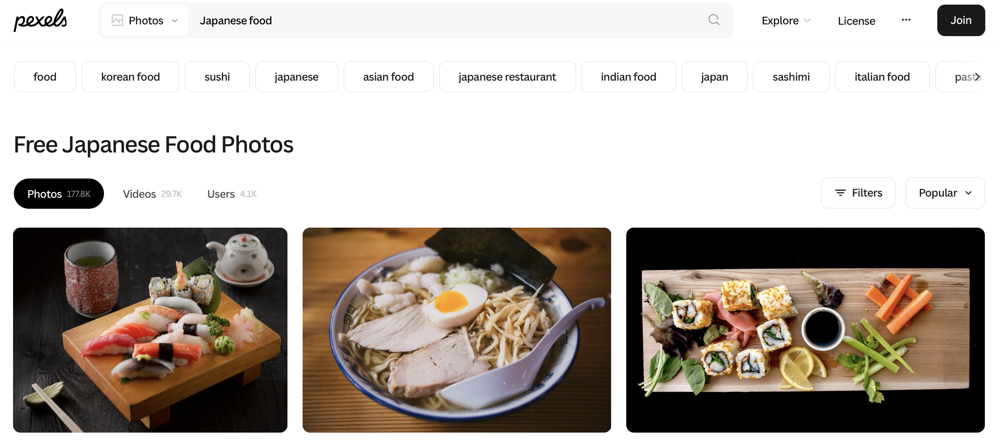
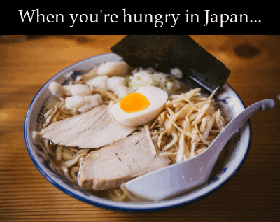

```{r setup, include=FALSE}
library(tidyverse)
knitr::opts_chunk$set(echo=TRUE, message=FALSE, warning=FALSE, error=FALSE)
selected_photos <- read_csv("selected_photos.csv")
```
```{css echo=FALSE}
html, body {
  background: linear-gradient(to right, aliceblue, #ff8085);
}
p,h1,h2,h3,h4 {
  font-family: "メイリオ","Hiragino Kaku Gothic Pro",Meiryo,"ヒラギノ角ゴ Pro W3","MS PGothic","MS UI Gothic",Helvetica,Arial,sans-serif;
}
h1, h2, h3 {
  font-weight: bold;
}
img {
  max-width: 100% !important;
}
pre {
  margin: 1em;
}
.hljs {
  display: block;
  border-radius: 0.2em;
  padding: 0.5em;
  background-color: black;
  color: white;
  text-wrap: wrap;
}
table {
  width: 100%;
  border-collapse: collapse;
  border: 1px solid #ccc;
  background-color: #fdfdf8;
  color: #333;
}

th, td {
  border: 1px solid #ccc;
  padding: 0.2em;
  text-align: left;
}
```

## Introduction

The two words that I chose to search for images on [pexels.com](pexels.com) were **Japanese** and **Food**. I wanted to search for this because I am very interested in the Japanese culture, one of the reasons is food! 

Heres the link to the Pexels search page: [link](https://www.pexels.com/search/japanese%20food/)

Heres the link to the API query: [link](https://api.pexels.com/v1/search?query=Japanese%20food&per_page=80)

Observations concluded:

1. Most of the pictures that show up in Pexels are a landscape orientation, this is probably because pictures of food want to give more coverage, while portraits are normally used to highlight a specific detail.

2. The main colours observed in the pictures are warmer colours, this is because the majority of the japanese food have a warm colour palette such as red, orange, and yellow.

3. Most images typically have between 150-250 likes.



```{r}
selected_photos %>%
  select(url) %>%
  knitr::kable()
```

## Key features of my selected photos

```{r}
# Get the grouped average aspect aspect_ratio
grouped_average_aspect_ratios <- selected_photos %>%
    group_by(orientation) %>%
    summarise(mean_aspect_ratio = mean(aspect_ratio, na.rm = TRUE))
# Get the mean aspect ratio for landscape images
mean_aspect_landscape <- grouped_average_aspect_ratios %>%
    filter(orientation == "landscape") %>%
    pull(mean_aspect_ratio) %>%
    round(2)
# Get the mean aspect ratio for portrait images
mean_aspect_portrait <- grouped_average_aspect_ratios %>%
  filter(orientation == "portrait") %>%
  pull(mean_aspect_ratio) %>%
  round(2)
# Get the average alt text length
average_alt_text_length <- selected_photos$alt_text_length %>%
    mean(na.rm = TRUE) %>%
    round()
# Get the most common orientation
most_common_orientation <- selected_photos %>%
    count(orientation, sort = TRUE) %>%
    slice(1)
```

**Average aspect ratios:**

The average aspect ratio of landscape images is ``r {mean_aspect_landscape}``.

The average aspect ratio of portrait images is ``r {mean_aspect_portrait}``.

**Orientation:**

The most common orientation was ``r {most_common_orientation$orientation}`` with a count of ``r {most_common_orientation$n}``.

**Alt text:**

The average alt text length was ``r {average_alt_text_length}``

## Creativity



I'm quite proud of my creativity gif, it combines 5 very popular and delicious meals you can find in Japan. I've selected a font (Palatino) that suits the classy foods, this required some documentation from R! Initially I planned on using the same font as the Rmd but thought it was risky to use a font that might've been exclusive in certain operating systems. The image URLs are also not hard coded, they're taken with a vector slice from the selected data! I've also scaled all the images per frame to ensure that the GIF is consistent between each frame. In each frame, theres also a section of text that annotates what the food is and makes the GIF more exciting!

I'm also very proud of the CSS and HTML skills that i've learnt during this course. I've changed the font to match the usual Japanese fonts to match the overall theme of Japanese food. The gradient in this page goes from a light white colour to a light red colour, representing the Japan flag and cultural colours. I've also used some additional markdown skills we've learnt in the course such as code text to wrap around some variables to make it easier to read. The code-block has also been modified to use a dark-mode instead of light-mode! I've also used CSS in the links table to make it actually look like a table, I think this is an excellent improvement for readability. 

## Learning reflection

I've learnt quite a lot of important ideas but the most important one is manipulating JSON data and converting them into data frames. It was very fun learning this as I've used APIs in other coding languages and doing this in R was quite interesting. I found several common points such as in other languages we call a data frame an object, and that the logic is very similar (converting JSON to an object). I've also learnt a lot of key methods such as `mutate()` which allows us to create a complete extra field of data that we can customise to our own needs!

I'm more curious on working with some more graphing and image generation, I feel like module 3 was very interesting in providing information on new methods but it's still very similar to the past modules where we manipulated with data frames. It would be a lot more interesting to involve more image rendering and graph generation!

## Appendix
```{r file='exploration.R', eval=FALSE, echo=TRUE}

```
```{r file='project3_report.Rmd', eval=FALSE, echo=TRUE}

```