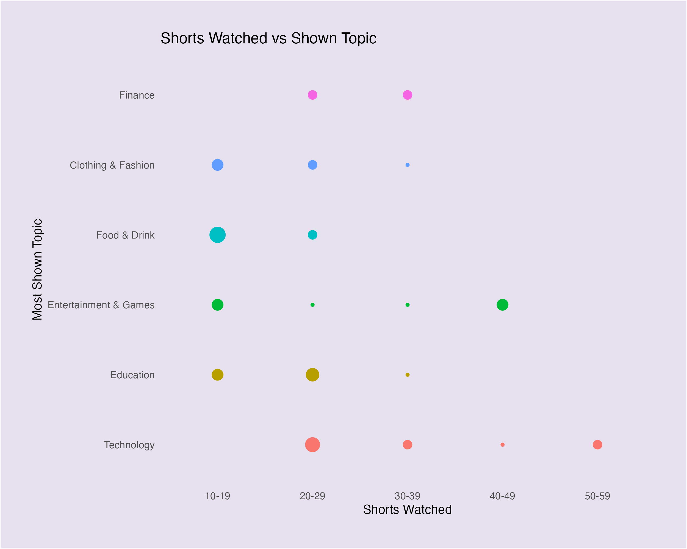
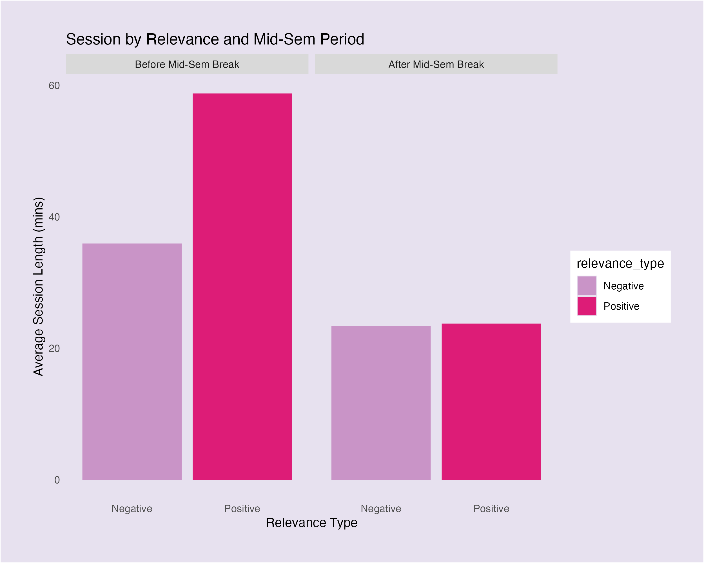

<script src="https://code.jquery.com/jquery-3.7.1.min.js" integrity="sha256-/JqT3SQfawRcv/BIHPThkBvs0OEvtFFmqPF/lYI/Cxo=" crossorigin="anonymous"></script>

```{r setup, include=FALSE}
knitr::opts_chunk$set(echo=FALSE, message=FALSE, warning=FALSE, error=FALSE)
```

```{js}
$(function() {
  $(".level2").css('visibility', 'hidden');
  $(".level2").first().css('visibility', 'visible');
  $(".container-fluid").height($(".container-fluid").height() + 300);
  $(window).on('scroll', function() {
    $('h2').each(function() {
      var h2Top = $(this).offset().top - $(window).scrollTop();
      var windowHeight = $(window).height();
      if (h2Top >= 0 && h2Top <= windowHeight / 2) {
        $(this).parent('div').css('visibility', 'visible');
      } else if (h2Top > windowHeight / 2) {
        $(this).parent('div').css('visibility', 'hidden');
      }
    });
  });
})
```

```{css}
html, body {
  background: linear-gradient(to right, #e7e1ef, #c994c7);
}
p,h1,h2,h3,h4,ul {
  font-family: 'Lucida Sans', 'Lucida Sans Regular', 'Lucida Grande', 'Lucida Sans Unicode', Geneva, Verdana, sans-serif;
}
h1, h2, h3 {
  font-weight: bold;
}
img {
  max-width: 100% !important;
}

.figcaption {display: none}
```

## Are session times linked to more skipping?

This density plot shows that users are who skipped more shorts than they liked tend to have shorter social media sessions. There is a clear peak around `20-25` minutes. 

In contrast, users who liked more content had slightly longer sessions on average. 

This potentially suggests that more impulsive behaviour (skipping) may associate shorter attention spans and reduced engagement time. Another suggestion based on the data is that if your shorts are more targetted (more likes), your potential view time is longer. 


## Does shorts watched determine a specific trend on what topic I watch?

This graph depicts a count plot that explores the relationship between the number of shorts watched and the most shown topic during the session. Each point represents how often a particular topic appeared within each range of shorts watched. 

Notably, the more shorts watched, the more it drifted towards topics that peaked my interest, this in particular was `Technology`, and `Entertainment & Games` which appeared consistently across a wider range of viewing durations. This surprisingly matches with my study and interested (Computer Science)!

In contrast, `Finance`, `Clothing & Fashion`, and `Food & Drink` were more niche, appearing in the lower ranges of shorts watched. 

`Education` was mostly concentrated between the `20-29` shorts watched range as data recorded was also before mid semester break and displays a trend towards education related reels. 



## Comparison of session length and liked relevance, based on engagement type and time period. 

This bar chart compares average session lengths and the relevance of liked shorts across two time periods:

* Before mid semester break
* After mid semester break

Each bar represents an engagement type, where I liked more content or skipped more and shows the average session length and how relevant I found the content. 

It can be seen that before the break, I liked more shorts had significantly longer sessions and reported much higher content relevance. It also shows that there is a higher session length proportional to the liked relevance in comparison to after mid semester break.

The contrast shows that I was more likley to have more time on shorts prior to the mid semester break, this depicts that course work gradually builds up over time, resulting in less time. 


## How positively relevant or negatively relevant were my shorts before and after mid semester break?

These bar charts compares average session lengths based on how I rated the contents relevance; either positively or negatively before and after the mid semester break. Before the break, sessions were noticeably longer, and I found liked content more positive in relevancy. 

However,after the break, average session lengths dropped. The positive and negative gap has also disappeared with both of them around 24 minutes. I've been less engaged to shorts, most likely due to course workload, and declining interest. 

