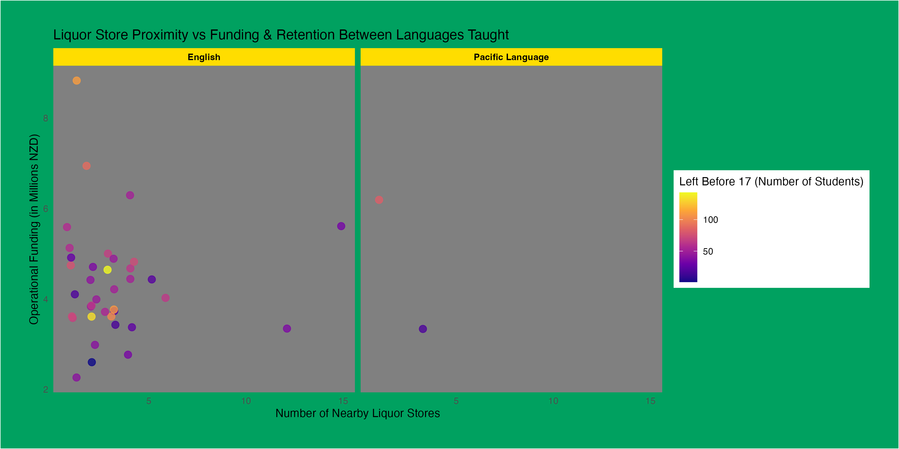

```{css echo=FALSE}
html, body {
  background: linear-gradient(to right, #00a160, #ffdd00);
}

p,h1,h2,h3,h4,ul {
  font-family: system-ui, -apple-system, BlinkMacSystemFont, "Segoe UI", Roboto, "Helvetica Neue", Arial, "Noto Sans", sans-serif, "Apple Color Emoji", "Segoe UI Emoji", "Segoe UI Symbol", "Noto Color Emoji";
}

h1, h2, h3 {
  font-weight: bold;
}
```

## Introduction

My high school that I went to had a lot of students and had quite a few liquor stores very close by the school. I wanted to observe something similar in this report, this meant filtering schools that had at least 1.5k students (my school had ~1.8k), was a secondary school, and was in a major urban area. 

My school also had a fairly high docile so I wanted to target the more urban schools as it is more likely for them to be considered more "wealthy", I also wanted to look towards the donations received in a school and see if that affected the liquor store appearance around the proximity of the school (a target towards the RNZ [article](https://www.rnz.co.nz/news/in-depth/509520/school-donations-continue-to-yield-millions-of-dollars-for-wealthier-schools))

I think it was responsible to scrape data from my high school's website as I had checked the `robots.txt` file and there was nothing noting no scraping, I also looked for any ToS or Privacy Policy and nothing had prohibited scraping.

## Visualisation

The main purpose of my visualisation is to identify any trends based on liquor store proximity vs the school funding amount (in millions NZD) and retention. I was quite curious as my school had quite a lot funding yet had a lot of school leavers before 17 years old. I wanted to see if there was any form of correlation between the funding and liquor store proximity, also held in contrast between English and Pacific language taught schools. 

The distribution between Pacific and English language taught schools look very similar although it would be good if there was more data towards Pacific language schools to identify any further trends. 

As can be seen from the graph that the most funded school ~9 million had the least amount of liquor stores within a close proximity (~ 1-2), yet had ~150 leavers in total. Following the result, a school with a ~6 million in funding(a fairly average funding) had over 12 liquor stores but had a low leaver rate of about 30-40 students in total. 



## Creativity

My colour theme is chosen with care, I specifically used a colour theme that matched my high school's diverse colours of green, yellow, and black. I used [Image Colour Picker](https://imagecolorpicker.com) to select the exact HEX colours of the school banner to find out the colours!

I was also actually a high school leaver(prior to reaching 17 years old) in a sense where I finished high school a year earlier than normal (I entered uni at a discretionary application, where I didn't do NCEA level 3 due to exceptional grades in NCEA level 2). I wanted to to create another function to pull retention data as I was curious if liquor stores resulted in high school students leaving prior to them reaching 17 years old. 

I also had to look into the R documentation on changing the colours, the default one has a very poor highlight of using different lightness which was very difficult to read. I looked into the [documentation](https://ggplot2.tidyverse.org/reference/scale_viridis.html) and found the `scale_color_viridis_c` option which seemed very useful in my case (showing a distinct colour difference in the graph especially with the dark grey background, making it very easy to read now). 

My entire report also is based off from the school colours from my old high school! I also managed to inspect elements the school website to find the font that the website uses, to match a similar theme to the topic. 

## Learning reflection

The most important idea in this module was web-scraping, I find web scraping very interesting and it's very nice that we learn it in this course. Nowadays, it's mainly GPT or Google scraping websites although it's fun to do this by ourselves, and to analyse the data afterwards. I found this quite challenging but intriguing. 

Another aspect I wish we could learn and do more was with APIs, I feel like it was such a short area that we definitely could've expanded on with web scraping. I also wish that there was more creative freedom if we did have an API report, something where we can find an API ourselves (with / without a given topic) and work on the report ourselves. 

## Self review

I think the most important learning outcome to me is #2, "understanding concepts and skills associated with importing, wrangling and visualising data". Here are two of the key skills that I have learnt that aligns with the learning outcome:

1. I learnt heaps about image manipulation in the projects (despite it mainly to do with graphs), I think this is something very interesting and cool to learn, not a lot of courses teach your this, and especially this course teaching it in R (which is extremely fast in image processing). I've always wanted to make something that includes image processing or image concatenation, the `magick` library is perfect for that. 
2. I also think it's very nice that we are somewhat expected to write HTML and CSS, i've learnt this a lot before in a few other courses but just even in this course, I had to do some more learning or research on W3 schools to ensure my reports look nice and match the theme of the report. 

## Appendix
```{r file='data_sources.R', eval=FALSE, echo=TRUE}

```
```{r file='visualisation.R', eval=FALSE, echo=TRUE}

```
